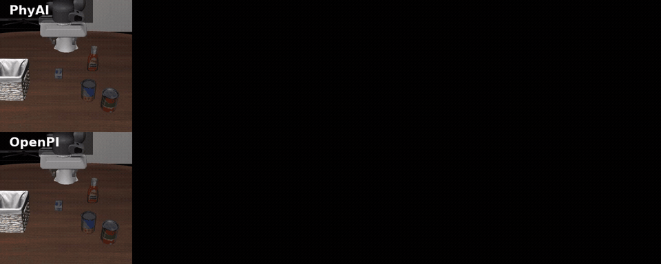
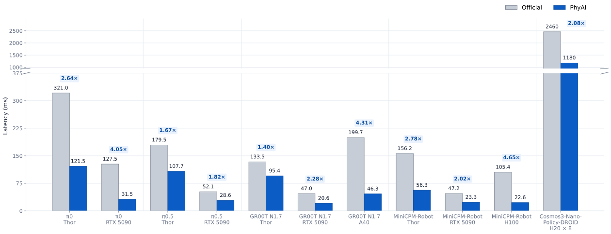
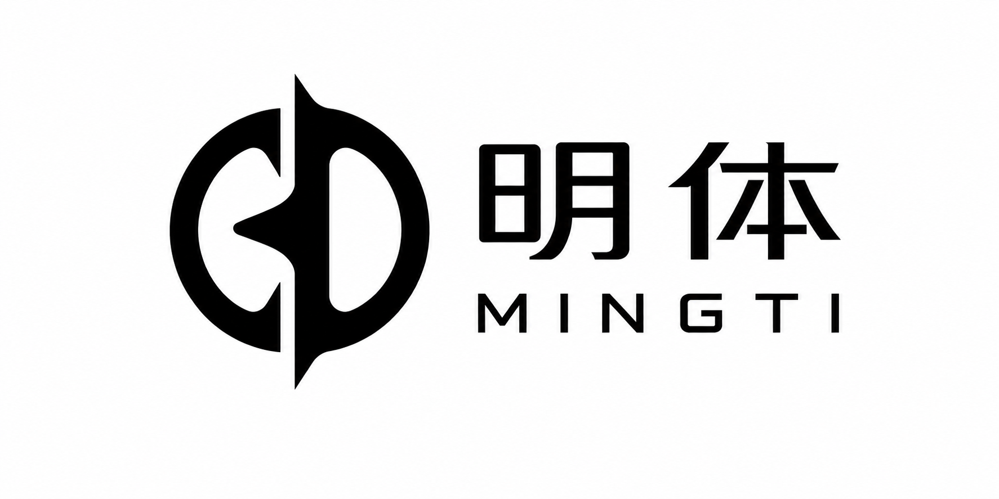

<p align="center">
  <picture>
    <source media="(prefers-color-scheme: dark)" srcset="docs/logo/dark.png">
    <source media="(prefers-color-scheme: light)" srcset="docs/logo/light.png">
    
  </picture>
</p>

<p align="center">
  <a href="https://mingti-org.github.io/phyai-blog/"></a>
  <a href="https://phyai.mintlify.app/"></a>
  <a href="https://github.com/mingti-org/phyai"></a>
  <a href="LICENSE"></a>
  <a href="https://github.com/mingti-org/phyai/issues"></a>
  <a href="https://mingti-org.github.io/phyai/simple/"></a>
</p>

----

**PhyAI** (pronounced "phi") is a **latency-first serving engine for Physical AI**.
It is designed first for latency critical workloads, such as policy and action
models that run in interactive systems.

<p align="center">
  
</p>

## News

- [2026/07] 🚀 Day 0 support for MiniCPM-Robotic [blog](https://mingti-org.github.io/phyai-blog/blogs/260719-day-0-minicpm-robotic/).
- [2026/07] 👏 Introducing PhyAI, a latency-first serving engine for Physical AI. [Read the Blog](https://mingti-org.github.io/phyai-blog/blogs/260718-phyai/).
- [2026/07] Support [PI0](https://phyai.mintlify.app/models/pi0/ws1).
- [2026/07] Support Cosmos3-Super (TP + CFG parallel) in the Cosmos3 [WN generation path](https://phyai.mintlify.app/models/cosmos/wn).
- [2026/06] Support [Pi0.5](https://phyai.mintlify.app/models/pi05/ws1) and Cosmos3-Nano's [policy mode](https://phyai.mintlify.app/models/cosmos/ws1_policy) & [gen mode](https://phyai.mintlify.app/models/cosmos/ws1).


## Key Features

- 🚀 Runs on NVIDIA Jetson edge devices
- 🚀 Scales to GPU clusters with DP, TP, and CFG parallelism
- 🚀 Uses high-performance kernels from FlashInfer and Humming
- 🤗 Supports W4A8 (NVFP4, MXFP4, INT4), W8A8, and W8A16 quantization (PR under review)

## Supported Models

<table align="center" width="100%">
  <tbody>
    <tr>
      <th align="center" width="22%">VLA</th>
      <td align="center">
        <a href="https://phyai.mintlify.app/models/pi0/ws1"><strong>&pi;0</strong></a>,
        <a href="https://phyai.mintlify.app/models/pi05/ws1"><strong>&pi;0.5</strong></a>(w/ DP),
        <a href="https://phyai.mintlify.app/models/gr00t/ws1"><strong>GR00T N1.7</strong></a>,
        <a href="examples/minicpm_gr00t/README.md"><strong>MiniCPM-Robot</strong></a>
      </td>
    </tr>
    <tr>
      <th align="center" width="22%">WAM</th>
      <td align="center">
        <a href="https://phyai.mintlify.app/models/cosmos/ws1_policy"><strong>Cosmos3-Nano-Policy-DROID</strong></a>(w/ TP, CFG Parallel)
      </td>
    </tr>
    <tr>
      <th align="center" width="22%">Foundation Model</th>
      <td align="center">
        <a href="https://phyai.mintlify.app/models/cosmos/wn"><strong>Cosmos3-Nano</strong></a>(w/ TP, CFG Parallel),
        <a href="https://phyai.mintlify.app/models/cosmos/wn"><strong>Cosmos3-Super</strong></a>(w/ TP, CFG Parallel),
        <a href="phyai/src/phyai/models/qwen3_5"><strong>Qwen3.5</strong></a>,
        <a href="phyai/src/phyai/models/qwen3_vl"><strong>Qwen3-VL</strong></a>
      </td>
    </tr>
  </tbody>
</table>

## Performance Comparison

<p align="center">
  
</p>

## Installation

See the [PhyAI installation guide](https://phyai.mintlify.app/) for the latest
source and nightly package instructions.

**From source:**

```bash
git clone https://github.com/mingti-org/phyai
cd phyai
uv sync
```

**Nightly build:**

```bash
uv pip install phyai phyai-ext \
  --extra-index-url https://mingti-org.github.io/phyai/simple/ \
  --prerelease=allow
```

## Contribution Guidelines

We thank the contributors below and welcome more developers to join us in building PhyAI.

<a href="https://github.com/mingti-org/phyai/graphs/contributors"></a>

## Sponsors & Adoption

PhyAI is a latency-first, open-source serving engine for Physical AI. It is being adopted by companies working across AI infrastructure and robotics, including Mingti and ModelBest.

We are actively seeking partnerships with compute providers, chip vendors, and robotics companies. If you are interested in working with us, please [contact us](#contact).

<table align="center" width="80%">
  <tbody>
    <tr>
      <td align="center" width="50%">
        
      </td>
      <td align="center" width="50%">
        
      </td>
    </tr>
  </tbody>
</table>

## Citation

If you use PhyAI in research or production work, please cite the project:

```bibtex
@software{phyai2026,
  title = {PhyAI: Latency-First Serving Engine for Physical AI},
  author = {{PhyAI Team}},
  year = {2026},
  url = {https://github.com/mingti-org/phyai}
}
```

<a id="contact"></a>
**Contact:**

We welcome PhD and master's students who want to help build Physical AGI, especially those interested in systems infrastructure. We also want to work with chip and compute companies, as well as robotics companies that plan to deploy models with PhyAI.

- PhyAI: [Maintainer](mailto:chenghua.wang.edu@gmail.com)
- Mengwei Xu: [mwx@bupt.edu.cn](mailto:mwx@bupt.edu.cn)
- Daliang Xu: [xudaliang@bupt.edu.cn](mailto:xudaliang@bupt.edu.cn)

## License

PhyAI is released under the [MIT License](LICENSE). It uses [FlashInfer](https://github.com/flashinfer-ai/flashinfer), [Humming](https://github.com/inclusionAI/humming), and [FLA](https://github.com/fla-org/flash-linear-attention). We have also learned a great deal from [SGLang](https://github.com/sgl-project/sglang), [vLLM](https://github.com/vllm-project/vllm), and [TokenSpeed](https://github.com/lightseekorg/tokenspeed). We thank the maintainers and contributors of all these projects.

## Demos

### Cosmos3-Nano-Policy-DROID, 260718 nightly version

https://github.com/user-attachments/assets/12a833ce-3b47-4f08-875c-b30cc2567bef

https://github.com/user-attachments/assets/8e7d433c-e3b1-4388-8488-196836a1ba51

https://github.com/user-attachments/assets/29067c88-f51a-4ca6-ab8c-b45f4d778923
